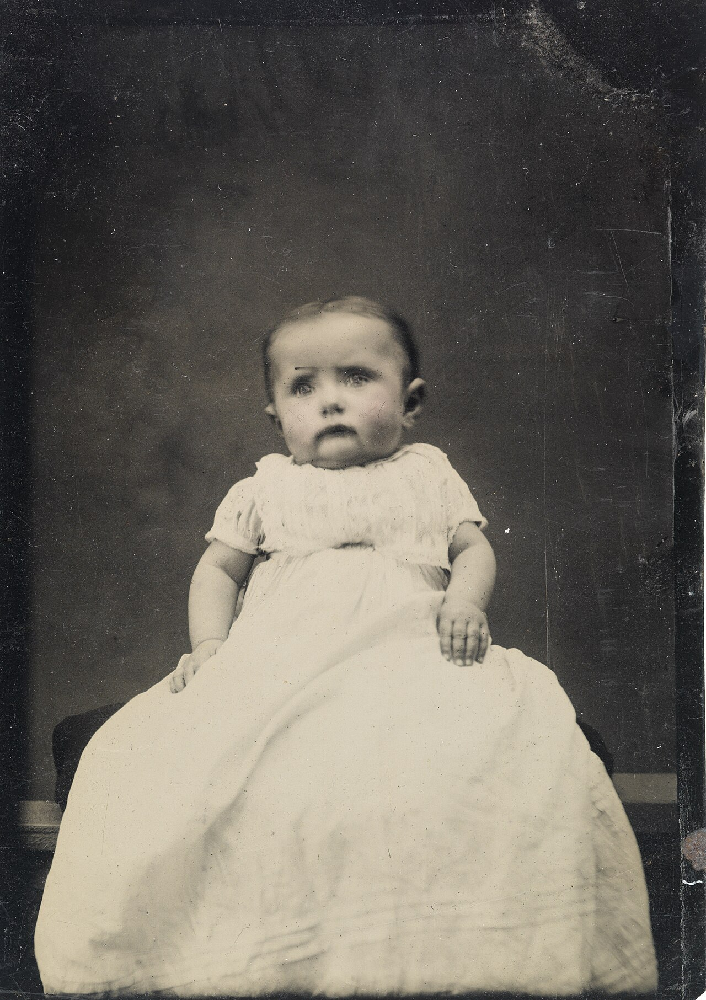
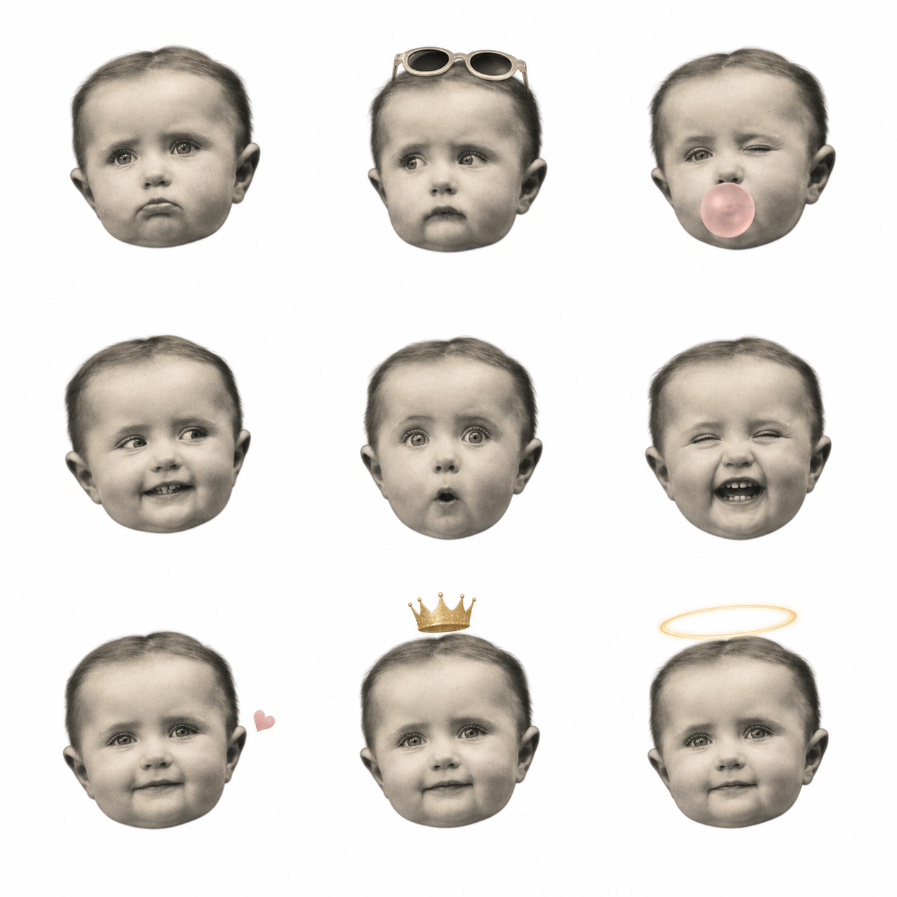
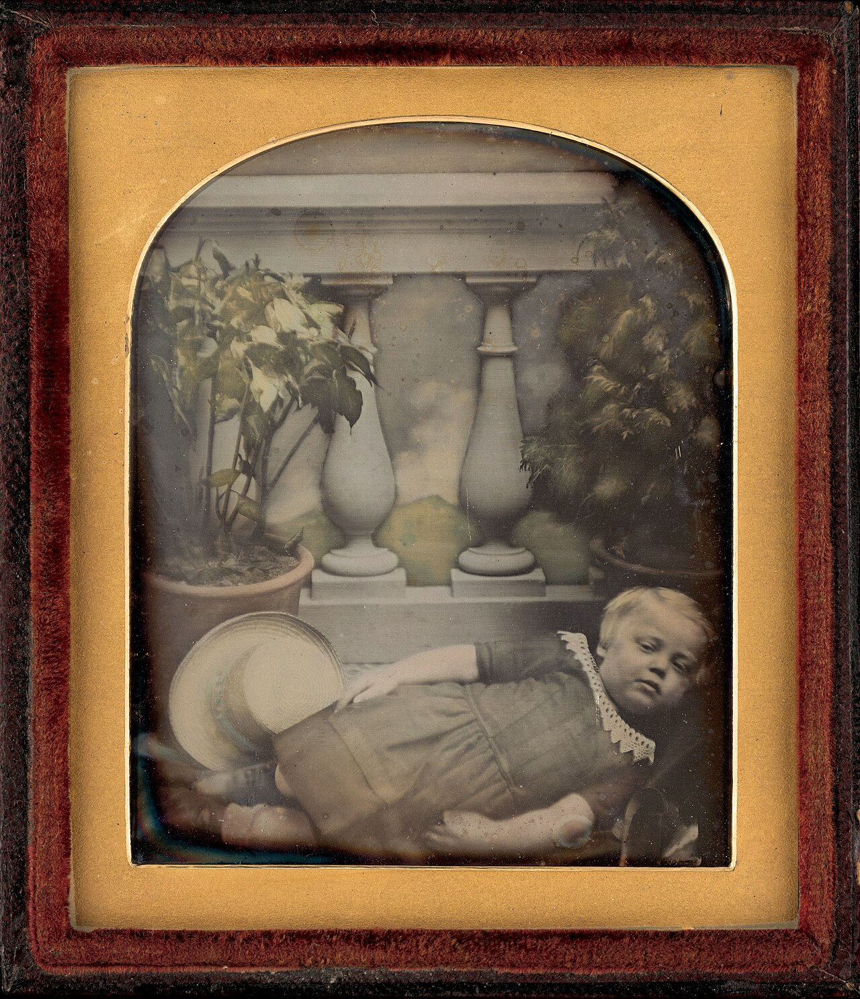
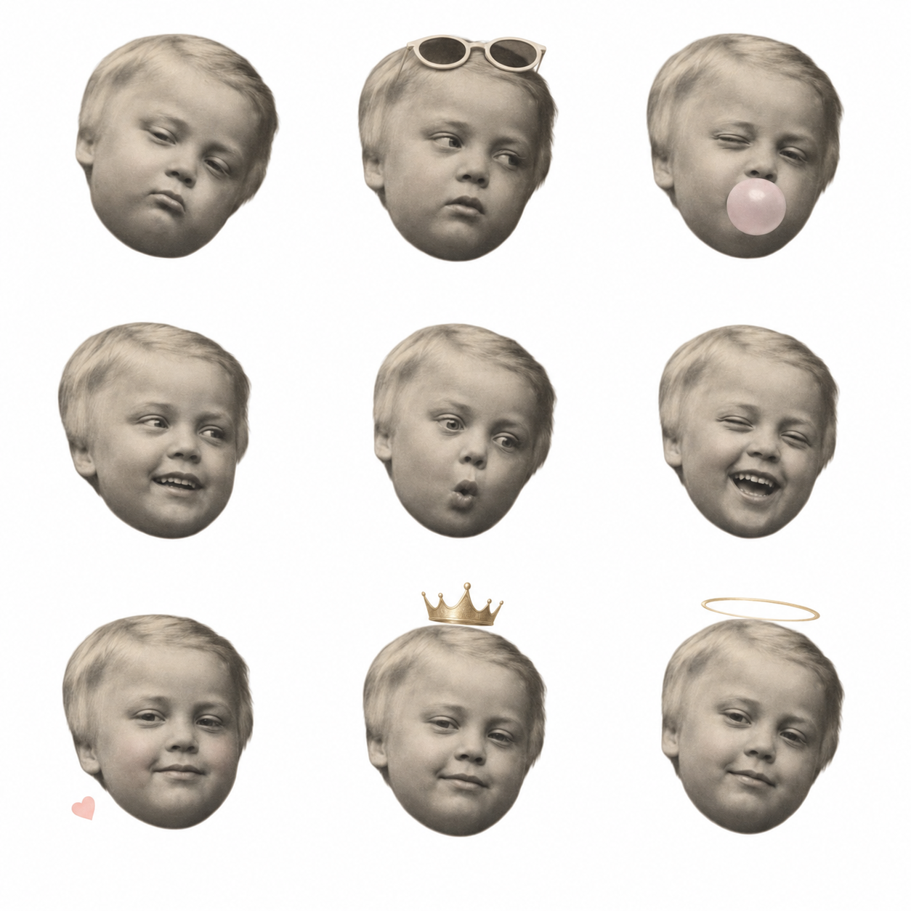
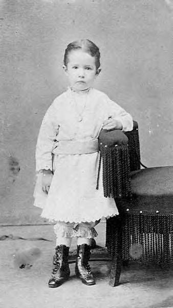
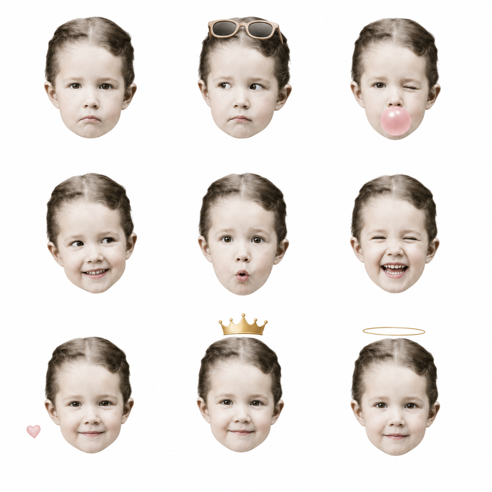

# Childhood AI Avatar Skill

把一张童年 / 婴幼儿照片转换成 **9 张高一致性白底萌娃头像 + 3×3 九宫格合集** 的可复用 Agent Skill。

核心设计原则：

> **用户原图决定“这个人是谁”，风格参考图只决定“做成什么样”。**

## ✨ Features

- 基于用户童年照保持人物身份一致性
- 默认生成 9 张独立 1:1 头像
- 自动生成 3×3 九宫格合集
- 内置 9 种表情 / 轻特效
- 支持半写实、毛绒、黏土、动漫、水彩、复古、贴纸、盲盒等扩展风格
- 强化“原图身份优先”，降低不同生成结果之间的漂脸问题
- 适合 ChatGPT、Codex、Claude Code、Gemini CLI、Cursor 等 Skill / Agent 工作流

## 🎭 Default 9 Effects

1. 嘟嘴 Pout
2. 侧目 + 墨镜 Side Glance + Sunglasses
3. 眨眼 + 粉色泡泡 Wink + Bubble Gum
4. 侧目露齿笑 Side Smile
5. 惊讶 O 嘴 Surprised O-face
6. 眯眼大笑 Squinty Laugh
7. 红晕 + 小爱心 Blush + Heart
8. 小皇冠 / 生日帽 Tiny Crown / Party Accent
9. 天使感柔笑 Soft Angelic Smile

## 📁 Project Structure

```text
childhood-ai-avatar-skill/
├── SKILL.md
├── README.md
├── LICENSE
├── examples/
│   └── README.md
└── tests/
    ├── README.md
    └── cases.yaml
```

## 🚀 Usage

下载[仓库 ZIP](https://github.com/KenView/childhood-ai-avatar-skill/archive/refs/heads/main.zip)，或克隆仓库后，把整个目录放入 Agent Skills 目录并命名为 `childhood-ai-avatar-v2`：

```powershell
git clone https://github.com/KenView/childhood-ai-avatar-skill.git
Copy-Item -Recurse -Force .\childhood-ai-avatar-skill "$env:USERPROFILE\.codex\skills\childhood-ai-avatar-v2"
```

重新打开相关任务后，可以直接使用类似指令：

```text
根据我上传的童年照片，使用 $childhood-ai-avatar-v2，
生成 9 张白底单独头像，再生成一张 3×3 九宫格合集。
```

或者：

```text
注意，以我上传的童年照片作为人物身份主参考，
使用 $childhood-ai-avatar-v2 做一套九宫格。
```

如果想做其他风格：

```text
使用 $childhood-ai-avatar-v2，
根据我的童年照片生成 9 张黏土手办风头像，并制作九宫格。
```

## 🧠 Identity Preservation

本 Skill 特别区分两种参考：

- **Identity Reference**：用户上传的童年照片，决定人物五官、脸型、发型、年龄感等。
- **Style Reference**：案例图 / 抖音截图 / 风格图，只决定构图、表情、配饰、质感与光线。

核心约束：

```text
The user's uploaded childhood photo is the PRIMARY identity reference.
The reference photo determines WHO the child is.
Other images determine STYLE / EXPRESSION / LAYOUT only.
Identity preservation has higher priority than beautification.
```

## 🖼️ Demo Gallery

仓库包含 3 组可直接浏览和下载的公开 Demo，覆盖历史婴儿照片、复杂旧底片和低分辨率输入。所有输入素材均附来源与许可说明，未使用用户上传的私人照片。

| 历史输入 | 生成结果 |
| --- | --- |
|  |  |
|  |  |
|  |  |

完整来源、权利状态和低清输入限制见 [`examples/demos/README.md`](examples/demos/README.md)。

## 🎨 Extendable Styles

- White Studio / 半写实白底
- 3D Plush / 毛绒公仔
- Clay Figure / 黏土手办
- Anime / 日系动漫
- Watercolor / 绘本水彩
- Retro Childhood Photo / 复古儿童照
- Sticker / 透明背景贴纸
- Cartoon / 卡通滤镜
- Blind-box Figure / 盲盒手办
- Pencil Sketch / 素描线稿
- Creamy Portrait / 奶油柔光写真

详细规则与 Prompt 模板请查看 [`SKILL.md`](./SKILL.md)。

## ⚠️ Notes

- 生成式模型无法保证像传统人脸识别一样的 100% 身份锁定。
- 原始照片越清晰，人物一致性通常越好。
- 强艺术化风格可能降低与原照片的相似度，因此建议先生成半写实高保真版本，再扩展风格。
- 不建议使用其他人物照片作为强风格参考，以免发生身份漂移。

## 📄 License

MIT License.
