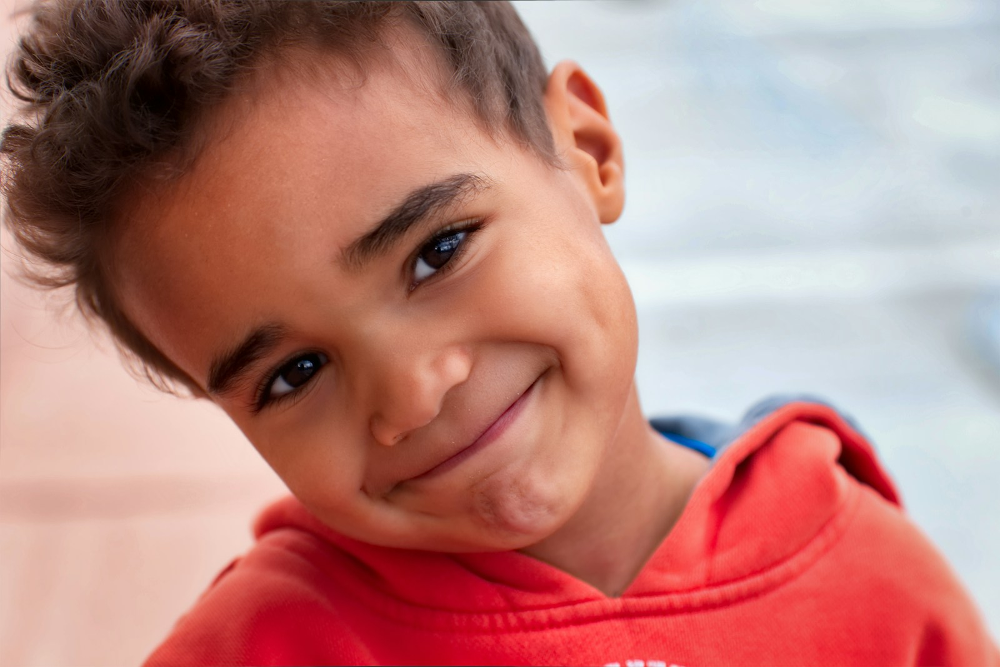
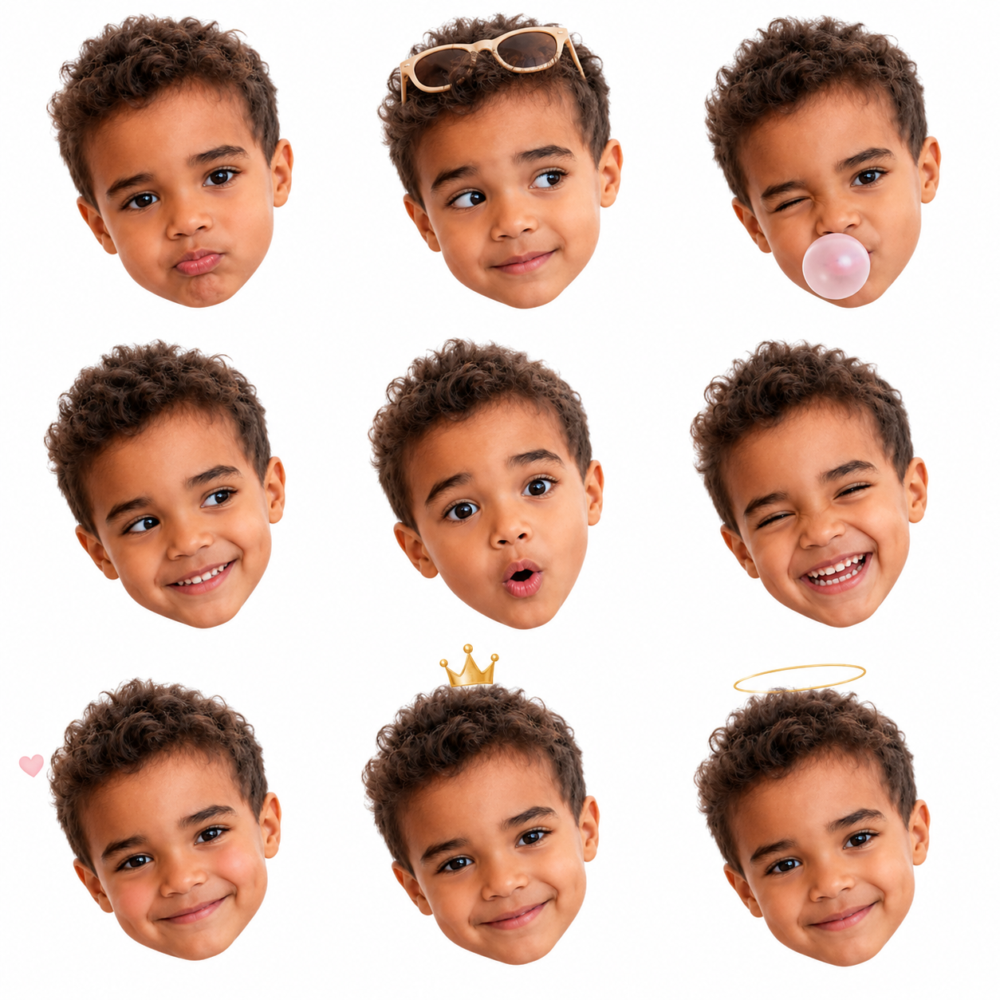
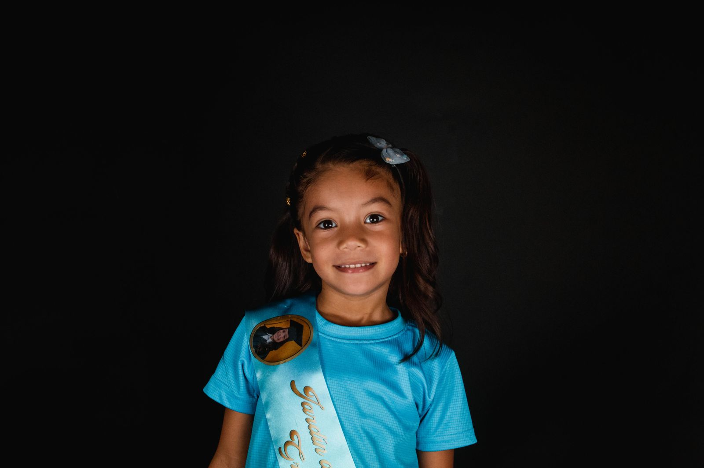
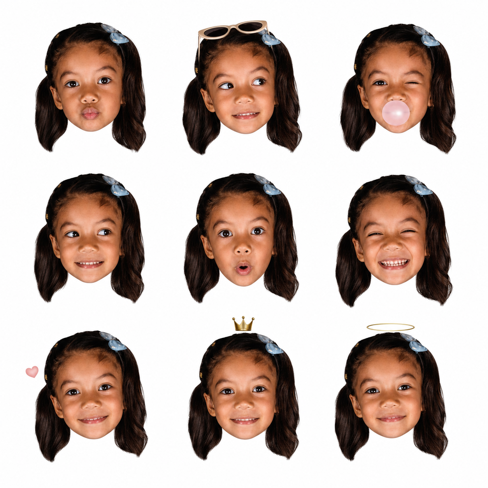
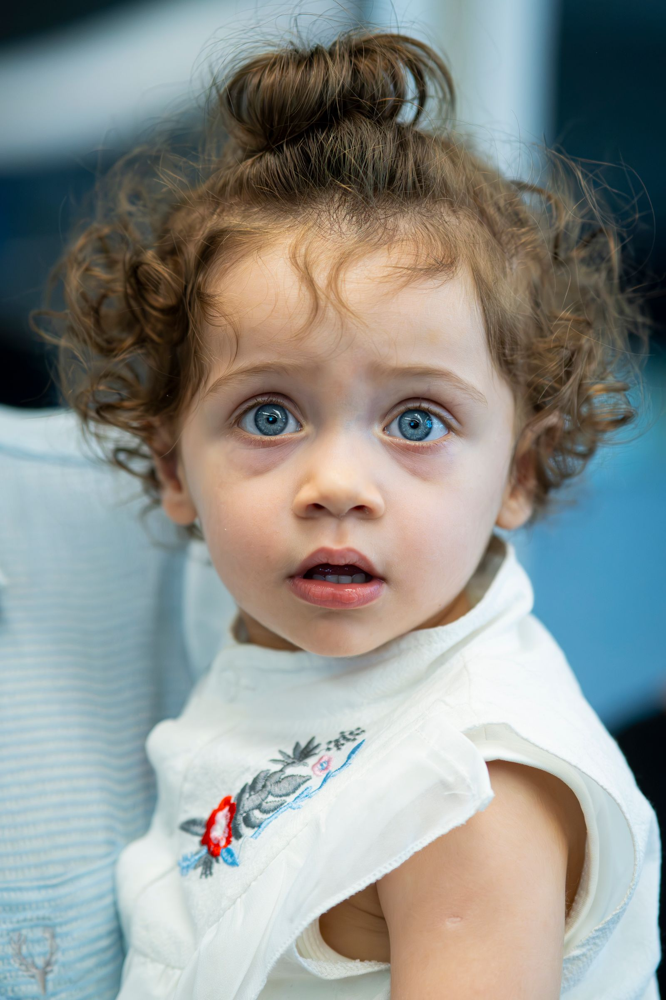
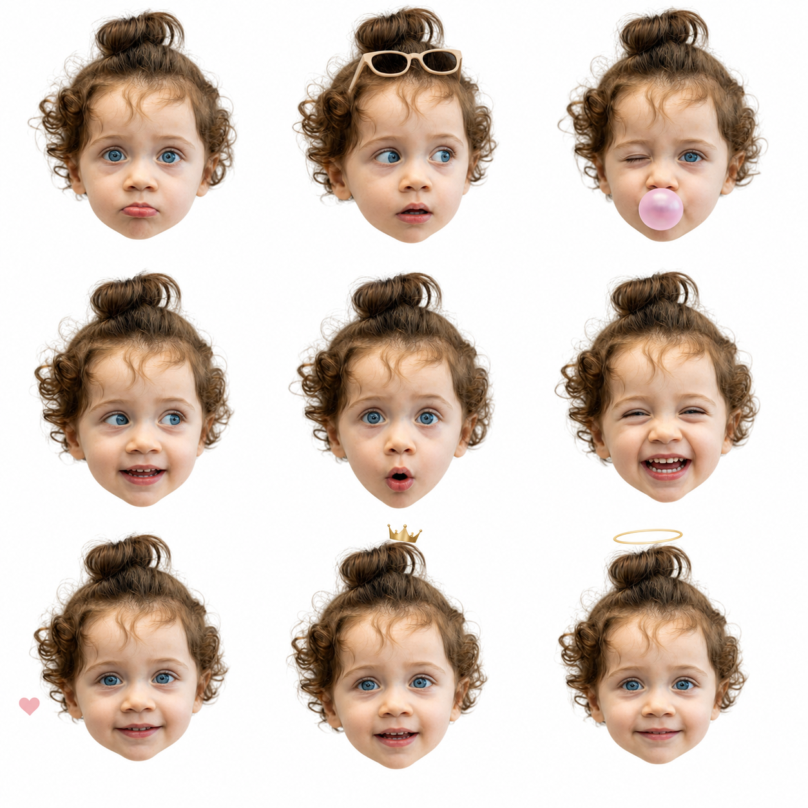

# Recent-photo demo gallery

这些 Demo 使用近几年发布的授权图库儿童照片作为身份参考，展示 `childhood-ai-avatar-v2` 的默认九宫格效果。生成结果由 Codex 内置图像生成工具依据本仓库 `SKILL.md` 的流程生成，未使用用户上传的私人照片。

> 生成式模型只能近似保持人物身份，输出不是原人物的真实新照片，也不代表照片中的人物、监护人或摄影师对本项目作出认可。

## Demo 1：2022 年自然光微笑男孩

| 输入 | 3×3 输出 |
| --- | --- |
|  |  |

- 摄影：[Acton Crawford](https://unsplash.com/@acton_crawford)，发布于 2022 年 5 月 31 日。
- 来源：[Unsplash 原始照片页面](https://unsplash.com/photos/a-close-up-of-a-child-with-a-smile-on-his-face-p_ciIrnvA8o)。页面说明摄影者认识孩子的父母，并获其同意分享照片。
- 使用条款：[Unsplash License](https://unsplash.com/license)。

## Demo 2：2024 年棚拍微笑女孩

| 输入 | 3×3 输出 |
| --- | --- |
|  |  |

- 摄影：Fabricio Miranda，发布于 2024 年 1 月 4 日。
- 来源：[Pexels 原始照片页面](https://www.pexels.com/photo/portrait-of-cute-girl-19697930/)。
- 使用条款：[Pexels License](https://www.pexels.com/license/)。

## Demo 3：2025 年德黑兰蓝眼睛幼儿

| 输入 | 3×3 输出 |
| --- | --- |
|  |  |

- 摄影：amin naderloei，发布于 2025 年 6 月 4 日。
- 来源：[Pexels 原始照片页面](https://www.pexels.com/photo/adorable-curious-child-with-blue-eyes-in-tehran-32407964/)。
- 使用条款：[Pexels License](https://www.pexels.com/license/)。

## 生成约束

三个输出均使用相同的默认顺序：

1. 嘟嘴
2. 侧目与头顶墨镜
3. 眨眼与粉色泡泡
4. 侧目露齿笑
5. 惊讶 O 嘴
6. 眯眼大笑
7. 红晕与小爱心
8. 小皇冠
9. 天使感柔笑

统一要求为纯白背景、仅头部、3×3 排列、无文字和水印，并把每张输入照片作为唯一人物身份参考。

## 许可说明

原始输入图片继续受上面逐项列出的 Unsplash 或 Pexels 条款约束，不因被收录到本仓库而改为 MIT License，也不应被从本仓库抽取后作为独立图库素材重新分发。生成的 Demo 输出均明确为 AI 生成内容，并在法律允许的范围内随本仓库 MIT License 提供；本项目不作身份相似度、权利状态或特定用途适用性的保证。
